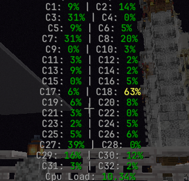
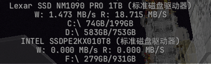

## 记录器

## 记录器（Logger）

### /log cpu all / fullcore（默认）/ percore

显示服务器 CPU 使用情况。

- `all`：显示总体与单核心信息
- `fullcore`：显示所有逻辑核心占用（默认）
- `percore`：显示单核心占用详情

---

### /log memAllocate

移植自客户端的 Memory Allocate 监控功能。

用于查看 JVM 内存分配速率（Allocation Rate），可辅助分析频繁 GC 或内存抖动问题。

---

### /log network uploadAndDownload / totalUploadAndDownload / both（默认）

查看服务器物理网卡的网络流量信息。

- `uploadAndDownload`：实时上传/下载速度
- `totalUploadAndDownload`：累计上传/下载流量
- `both`：同时显示实时速度与累计流量（默认）

---

### /log sysMemory Physical / Swap / Both（默认）

查看系统内存使用情况。

- `Physical`：物理内存使用量/总容量
- `Swap`：交换空间（虚拟内存）使用量/总容量
- `Both`：同时显示物理内存与交换空间信息（默认）

---

### /log disk ReadAndWrite / Storage / Both（默认）

查看服务器磁盘状态。

- `ReadAndWrite`：实时磁盘读写速度
- `Storage`：磁盘已用容量/总容量
- `Both`：同时显示读写速度与存储容量信息（默认）

### /log entities

查看每个维度的实体数量