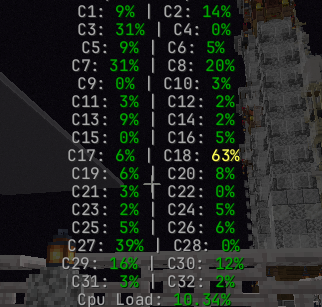
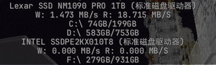

## Antideath Carpet Addition
一个为Fabric服务器编写的 Carpet 拓展

_**感谢 @[_OptiJava_](https://github.com/OptiJava) 的指导**_

## 前置模组

| 名称          | 类型 | 链接                                                                                                                                                                       | 备注 |
|-------------|----|--------------------------------------------------------------------------------------------------------------------------------------------------------------------------|----|
| Carpet      | 必须 | [MC百科](https://www.mcmod.cn/class/2361.html) &#124; [Modrinth](https://modrinth.com/mod/carpet) | -  |
| Fabric API  | 必须 | [MC百科](https://www.mcmod.cn/class/3124.html) &#124; [官方](https://fabricmc.net/)                                                                                          | - |

## 版本支持

| MC版本   | 当前开发状态 | 最后支持版本 |  
|--------|------|--------|
| 1.21.x | 持续更新   | -      |
| 26.1   | 持续更新   | -      |

## 记录器

## 记录器（Logger）

### /log cpu all / fullcore（默认）/ percore

显示服务器 CPU 使用情况。

- `all`：显示总体与单核心信息
- `fullcore`：显示所有逻辑核心占用（默认）
- `percore`：显示单核心占用详情

---

### /log memAllocate

移植自客户端的 Memory Allocate 监控功能。

用于查看 JVM 内存分配速率（Allocation Rate），可辅助分析频繁 GC 或内存抖动问题。

---

### /log network uploadAndDownload / totalUploadAndDownload / both（默认）

查看服务器物理网卡的网络流量信息。

- `uploadAndDownload`：实时上传/下载速度
- `totalUploadAndDownload`：累计上传/下载流量
- `both`：同时显示实时速度与累计流量（默认）

---

### /log sysMemory Physical / Swap / Both（默认）

查看系统内存使用情况。

- `Physical`：物理内存使用量/总容量
- `Swap`：交换空间（虚拟内存）使用量/总容量
- `Both`：同时显示物理内存与交换空间信息（默认）

---

### /log disk ReadAndWrite / Storage / Both（默认）

查看服务器磁盘状态。

- `ReadAndWrite`：实时磁盘读写速度
- `Storage`：磁盘已用容量/总容量
- `Both`：同时显示读写速度与存储容量信息（默认）

## ACA的所有规则
### 铁砧不会因掉落而损坏(anvilNeverDamageByFalling)

- 类型：`布尔值`
- 默认值：`false`
- 参考选项：`true`，`false`
- 分类：`ACA`，`SURVIVAL`

### 信标卡顿优化(beaconLagOptimization)
优化信标逻辑以减小卡顿
- 类型：`布尔值`
- 默认值：`false`
- 参考选项：`true`，`false`
- 分类：`ACA`，`OPTIMIZATION`

### 展示框永远附着(ItemFrameAlwaysStayAttach)
展示框会一直附着在方块上(包括空气)
- 类型：`布尔值`
- 默认值：`false`
- 参考选项：`true`，`false`
- 分类：`ACA`，`OPTIMIZATION`

### 掉落物永不消失(itemNeverDespawn)
掉落物永远都不会消失
- 类型：`布尔值`
- 默认值：`false`
- 参考选项：`true`，`false`
- 分类：`ACA`，`COMMAND`

### 掉落物立即消失(itemdispawnimmediately)
⚠️ 该功能会导致重要掉落物损失！！！！！⚠️
- 类型：`布尔值`
- 默认值：`false`
- 参考选项：`true`，`false`
- 分类：`ACA`，`COMMAND`

### 不死图腾扳手(flippinToTemOfUndying)
实现类似仙人掌扳手的效果（PCA移植功能）
- 类型：`布尔值`
- 默认值：`false`
- 参考选项：`true`，`false`
- 分类：`ACA`，`SURVIVAL`

### 实体搜索命令(enableEntitySearchCommand)
可用于搜索实体（支持目标选择器）
- 类型：`布尔值`
- 默认值：`false`
- 参考选项：`true`，`false`
- 分类：`ACA`，`SURVIVAL`

### 实体搜索命令启用小地图支持(entitySearchCommandEnableXaeroMapSupport)
实体搜索命令启用Xaero小地图支持
- 类型：`布尔值`
- 默认值：`false`
- 参考选项：`true`，`false`
- 分类：`ACA`，`SURVIVAL`

### 启用命令拦截器(enableCommandPreventer)
可以拦截玩家执行的指令\
**命令 /preventcmd**
- 类型：`布尔值`
- 默认值：`false`
- 参考选项：`true`，`false`
- 分类：`ACA`，`COMMAND`

### 启用命令拦截器白名单(enableCommandPreventerWhiteList)
**需要开启命令拦截器**\
**格式 /preventcmd whitelist (list,add,remove) 命令**\
**list 列出已添加的命令列表**\
**add xxx 添加命令**\
**add xxx 移除命令**

- 类型：`布尔值`
- 默认值：`false`
- 参考选项：`true`，`false`
- 分类：`ACA`，`COMMAND`

### 启用命令拦截器黑名单(enableCommandPreventerBlackList)
**需要开启命令拦截器**\
**格式 /preventcmd whitelist (list,add,remove) 命令**\
**list 列出已添加的命令列表**\
**add xxx 添加命令**\
**add xxx 移除命令**
- 类型：`布尔值`
- 默认值：`false`
- 参考选项：`true`，`false`
- 分类：`ACA`，`COMMAND`

### 启用命令拦截器前缀(enableCommandPreventerPrefix)
**需要开启命令拦截器**\
**格式 /preventcmd whitelist (list,add,remove) 命令**\
**list 列出已添加的命令列表**\
**add xxx 添加命令**\
**add xxx 移除命令**
- 类型：`布尔值`
- 默认值：`false`
- 参考选项：`true`，`false`
- 分类：`ACA`，`COMMAND`

### 末影人不会被玩家激怒(endermanNeverGetAngryByPlayer)
末影人不会被玩家激怒
- 类型：`布尔值`
- 默认值：`false`
- 参考选项：`true`，`false`
- 分类：`ACA`，`SURVIVAL`

### 自定义信标范围(beaconRange)
自定义信标效果范围
- 类型：`整数`
- 默认值：0，100, 200, 500, 1000
- 参考选项：`true`，`false`
- 分类：`ACA`，`SURVIVAL`

### 自定义物品拾取范围(itemPickUpRange)
自定义信标效果范围
- 类型：`整数`
- 默认值：0，100, 200, 500, 1000
- 参考选项：`true`，`false`
- 分类：`ACA`，`SURVIVAL`

### 伪和平优化(fakePeaceOptimization)
优化强加在伪和平时的卡顿
- 类型：`布尔值`
- 默认值：`false`
- 参考选项：`true`，`false`
- 分类：`ACA`，`OPTIMIZATION`

### 村民优化(villagerOptimization)
优化刷铁机中村民的卡顿
- 类型：`布尔值`
- 默认值：`false`
- 参考选项：`true`，`false`
- 分类：`ACA`，`OPTIMIZATION`

### 船吸优化(boatOptimization)
- 类型：`布尔值`
- 默认值：`false`
- 参考选项：`true`，`false`
- 分类：`ACA`，`OPTIMIZATION`

### 蜜蜂优化(BeeOptimization)
- 类型：`布尔值`
- 默认值：`false`
- 参考选项：`true`，`false`
- 分类：`ACA`，`OPTIMIZATION`

### MCDR前缀兼容(mcdrPrefixCompatible)
可以让带有玩家名称前缀/后缀的服务器 兼容MCDR
- 类型：`布尔值`
- 默认值：`false`
- 参考选项：`true`，`false`
- 分类：`ACA`，`OPTIMIZATION`

